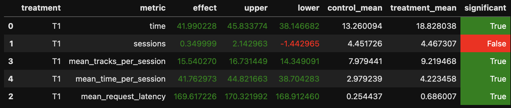

# recsys-hw-recommender

## Отчет по домашнему заданию № 2

### Abstract

Основная идея: чередуем свои версии LGCF и LFM-рекоммендеров (сохраняем историю прослушивания и название использованного рекоммендера, рекомендуем треки по порядку) с Indexed LGCF-рекоммендером с семинара (трек берется рандомный из всех рекомендаций).

Для рассмотрения на начальном были взяты рекоммендеры с семинаров: LGCF, LFM, Contextual и DSSM (расположены по убыванию их эффективности по сравнению со StickyArtist). Включение последних 2 рекоммендеров в различных сочетаниях параметров сильно понижало качество на a/b тестах (по отдельности они к тому же были хуже StickyArtist), поэтому было принято решение их убрать. LGCF-рекоммендер на большом числе данных изначально показывал себя очень хорошо по сравнению со StickyArtist, LFM-рекоммендер же был лишь немногим лучше. Поскольку они основаны на разных подходах и оба отрабатывают неплохо, было принято решение совмещать именно их, задействовав некоторые логичные эвристики: 
1. Не рекомендовать те же самые треки сильно подряд
2. Менять рекоммендер, если некоторое время пользователю не нравятся рекомендации
3. Рекомендовать случайный трек из начала списка рекомендаций, а не из всего списка (они все-таки отсортированы по скору, близости).

---

### Детали  

Для того, чтобы обучить рекоммендеры, был собран датасет (около 10 миллионов взаимодействий, из которых около 2 миллионов были положительные со скором >0.8). Часть данных была взята из чата курса, часть была собрана самостоятельно (в том числе с каждого семинара собиралось какое-то количество данных) с помощью StickyArtist и Random. С помощью jupyter notebook с семинаров были обучены несколько рекоммендеров (для вышеуказанных методов подбирались параметры и уже на a/b тестах выясняли, какой из них использовать), соответствующие рекоммендации хранятся в базе данных Redis.

Также появилась новая база данных. Реализация хранит в Redis (DB 8) для каждого пользователя:  
1. Список уже прослушанных треков (чтобы не предлагать дубли).  
2. Текущее состояние (метод и счётчик подряд «неуспешных» рекомендаций).

**Сам Алгоритм**  
1. Записываем `prev_track` в историю. 
2. Обновляем `fail_count` текущего метода:  
   - если `prev_time < threshold[method]`, то `fail_count++`, иначе `fail_count = 0`.  
3. При достижении `back_counts[method]` подряд «неуспехов» переходим на следующий метод (LGCF -> LFM -> LGCF old, далее зацикливаемся).  
4. Берём из выбранного метода первые `indexed_sample_size`=15 непрослушанных треков и случайно отдаём один.  
5. Если список пуст — сразу fallback (LGCF -> Random).

### Результаты A/B-эксперимента  



Симулятор был запущен на 10000 пользовательских сессий. Удалось побить StickyArtist. 

### Реализация и инструкция по запуску

При желании можно самостоятельно обучить вышеуказанне рекоммендеры снова с теми же параметрами, для этого в папке `jupyter` лежат notebook, использованные для обучения на kaggle. Данные для обучения (положительные взаимодействия) можно скачать по [ссылке](https://www.kaggle.com/datasets/statiana/recasts-hw). После обучения необходимо положить рекоммендации в привычную директорию (data в botify). Названия для файлов с рекоммендациями небходимо использовать те же, что и на семинарах.

Базы данных и необходимые пути к рекоммендациям прописаны в `config`, подключение к Redis выполянется в `server.py`, код полного рекоммендера можно найти в `dionis.py`.

1. Производим шаги инструкции запуска симулятора (например, создание и активация окружения, установка `docker` и прочее), скачиваем репозиторий.

2. Запускаем рекоммендер `botify` (из папки botify), предварительно открыв `docker-desktop`
   ```bash
   docker-compose up -d --build --force-recreate --scale recommender=2
   ```
3. Спустя некоторое время запускаем симулятор 
   ```bash
   cd ../sim
   python -m sim.run --episodes 10000 --config config/env.yml multi --processes 4
   ```
4. Сохраняем данные с контейнеров к себе 
   ```bash
   cd ../script
   python dataclient.py --recommender 2 log2local ~/Desktop/data
   ```
5. Проводим a/b тестирование с помощью соответствующего notebook `Test` в папке jupyter.
