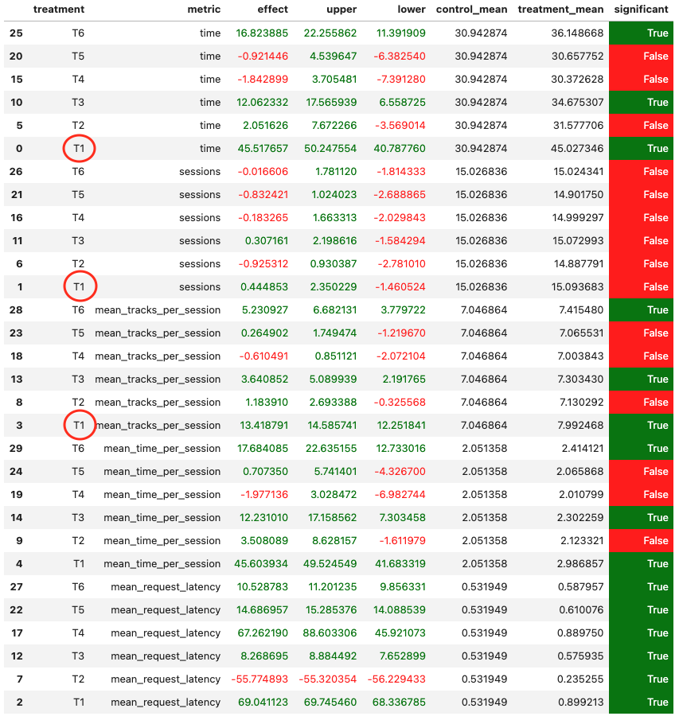

# Домашнее задание 2. Рекомендер музыкальных треков.

*Дедлайн: 11 мая 2025 23:59 MSK* 

Предложите улучшение сервиса botify и проведите A/B эксперимент. 
Критерий успеха – стат значимое улучшение метрики mean_session_time по сравнению с рекомендером StickyArtist (см. таблицу). 
Для проверки необходимо провести честный АВ-тест: в контроле показывать StickyArtist, а в тритменте - Ваш рекоммендер.

[данные для таблички](https://cloud.mail.ru/public/6kru/9EuRR29CX)

Расшифровка
- T1: StickyArtist
- T2: TopPop[100]
- T3: UserBased
- T4: lightfm
- T5: contextual
- T6: GCF
- C: random

## Можно

1. Использовать любые ML алгоритмы, даже те, про которые в курсе ничего не упоминалось.
   Главное, чтобы сервис стал лучше.
2. Делиться данными.
   Сбор данных может занимать довольно долго, поэтому нескольким людям допускается "скинуться" данными.
   У всех один и тот же симулятор, поэтому данные совместимы.
   
## Нельзя

1. Стырить решение коллеги (сюрприз).
2. Пользоваться данными, которые лежат в модуле sim.
3. **Сабмитить в качестве решения модификации StickyArtist. Нужно победить его именно с помощью ML!**

## Что на выходе

Пулл реквест из вашего форка в основной репозиторий курса. Он должен содержать следующее:

1. Отчет размером в одну страничку (пожалуйста!), содержащий:
   1. Abstract: основную идею эксперимента (1 параграф)
   2. Детали: минимум того, что нужно знать, чтобы разобраться в реализации (1-2 параграфа + диаграмма)
   3. Результаты A/B эксперимента - в табличке как на семинарах (1 параграф + табличка)
   
2. Реализацию домашки и инструкцию по запуску.
   Инструкция должна включать все от начала до конца: от установки дополнительных пакетов до того, что на какой машине запускается.
   Объем любой, чтобы я мог запустить все на своем ноуте, не думая.

Временем сабмита домашки счиитается время последнего изменения в пулл реквесте.

## Как мы будем проверять

1. Читаем отчет.
2. Смотрим код.
3. Если, необходимо, запускаем по инструкции.

Результат проверки отпишем коментом к ПР. Если будете согласны с оценкой, то нужно будет закрыть ПР (**не мержить!**).

За что балл может быть снижен:
- не победили StickyArtist,
- невалидный эксперимент (не тот контроль),
- решение аналогичное решению другого студента (см. формулу ниже),
- просрочка дедлайна (см. формулу ниже).

## Итоговая оценка за курс

Максимум за курс можно набрать **100 баллов**.
Итоговая оценка за курс складывается из компонент:

- [Макс: 44] Квизы: 11 штук по 4 каждый
- [Макс: 25] Домашка №1: 5 + (s - b) * (20 / (m - b)), где
  - s - ndcg Вашего решения
  - m - ndcg первого в лидерборде решения
  - b - ndсg бейзлайна
- [Макс: 35] Домашка №2: 35 * 0.95^(1 + d) * 0.95^k, где 
  - d - количество полных суток, прошедших после дедлайна, если домашка отправлена после дедлайна, иначе -1
  - k - количество аналогичных решений, которое встретилось проверяющему до проверки вашего решения
- [Макс: 10] Бонус за активность на занятиях
- [Макс: 5] Бонус за конструктивную обратную связь

Сумма пунктов выше больше 100, но все, что сверху - не считается.
